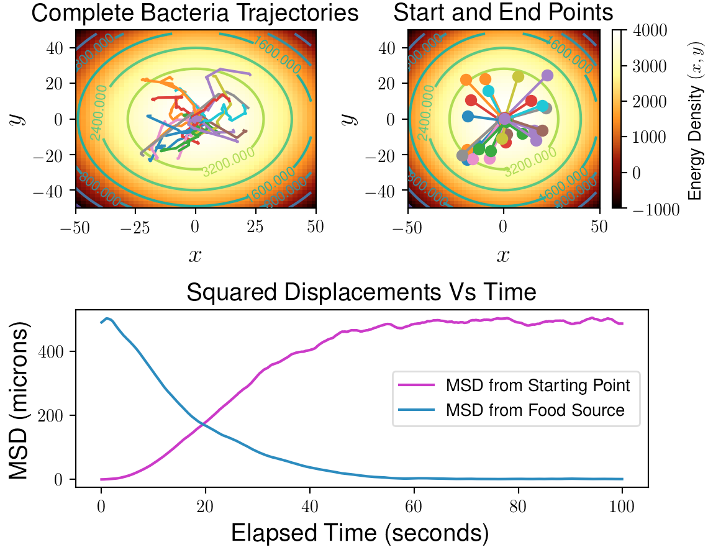

# Bacteria-Random-Walk
Primitive model of bacteria (flagellates) undergoing a biased random walk towards a food source.

The code has sensible default values and thus can simply be run as:

python3 Bacteria_Simulation.py

This will produce a figure that looks like:

    

Alternatively, various arguments can be passed, e.g:

python3 Bacteria_Simulation.py -num_bacteria 50 -timesteps 5000

Will run a simulation using 50 bacteria instead of the default 25, and will run for 5000 timesteps instead of the default 1000. Typing:

python3 Bacteria_Simulation.py --help

Will provide a full explanation of all possible arguments.
